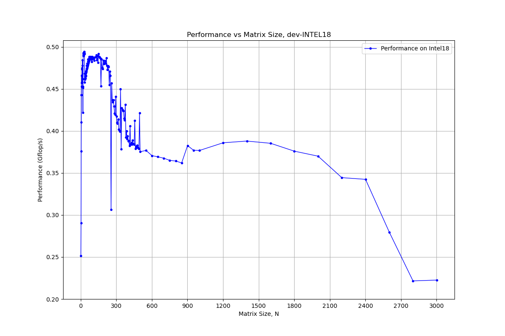
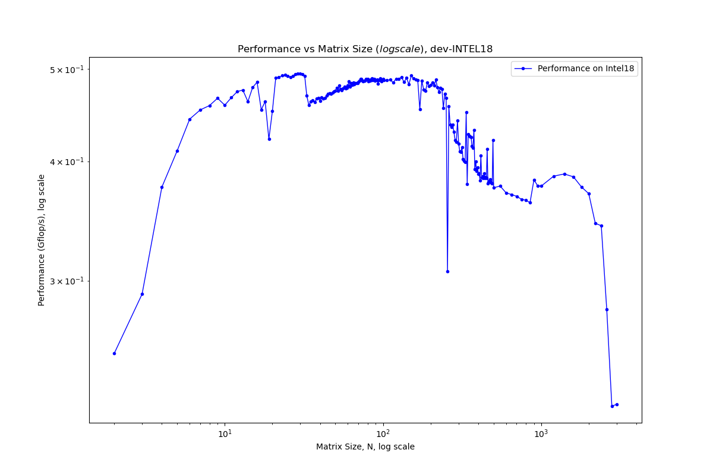
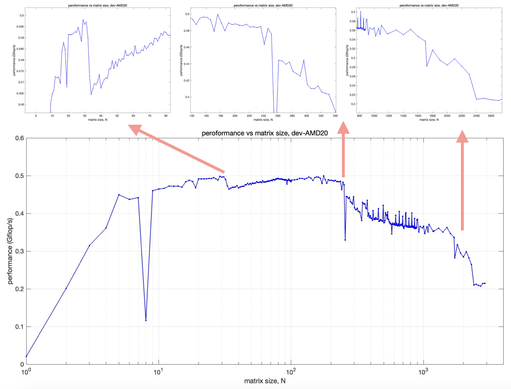
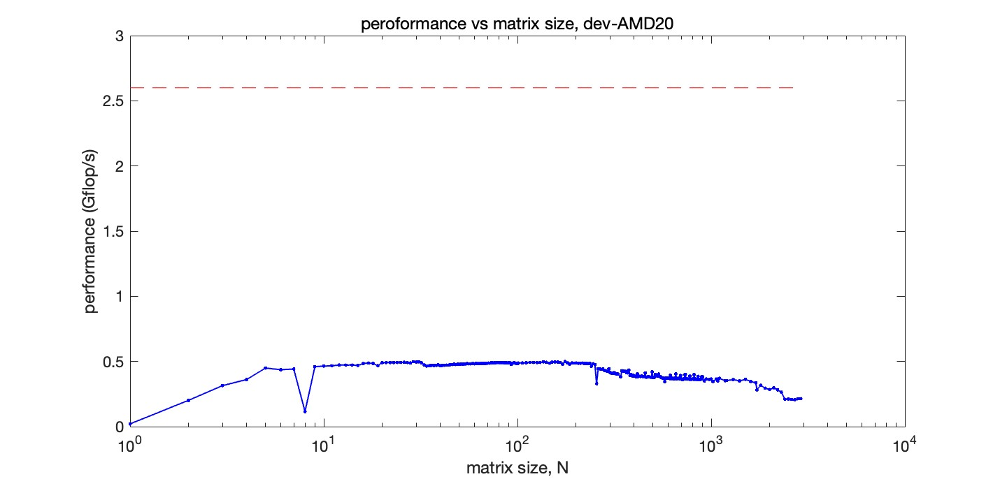

# 
 CMSE 822 &nbsp;&nbsp;&nbsp; SS24
## 
  Project 1  Memory Hierarchies and Performance of Serial Applications

  &#9786; Team 1  

  Benjamin DalFavero, Reza Khan Mohammadi, Tairan Song, Xiaotian Hua, Ziyu Cheng
  

## Warm-up

| | Operations (FLOPs) | Memory access (byte) | Algorithmic intensity (FLOPs/byte) |
| --- | --- | --- | --- |
|   Y[j] += Y[j] + A[j][i] * B[i] | 3 | 32 | 0.094 | 
|     s += A[i] * A[i]            | 2 | 8  | 0.250 | 
|     s += A[i] * B[i]            | 2 | 16 | 0.125 | 
|     Y[i] = A[i] + C*B[i]        | 2 | 24 | 0.167 |   

## Part 1 :  Matrix-matrix Multiplication

### Q2. For a given matrix size N, what is the total number of floating point operations performed by this operator?  

In a N*N matrix, the total number of floating point operations performed by matrix multiplication is $N^3+N^2(N-1)=N^2(2N-1)$ .   

### Q3. Compute the performance in Mflop/s of the matrix-matrix multiply for N=100.
Considering a matrix of size `100`, we repeated calculation for `20` times, the performance achieved is:
- *Performance:* 575.928 Mflops/s
- *Average time:* 0.003455 s
- *Floating-point operations:*  $100^2*(2*100-1) / 10^3 = 1.99$ Mflops

### Q4. How does the performance you measured in (3) compare to the theoretical peak performance of your system?
The laptop is Apple M2 pro chips:
- *CPU:* 12 cores
- *Clock speed:* 3.4 GHz
- *Cache:* 192 KB instruction cache, 128 KB data cache

Assuming one flop per clock cycle, the peak performance is: $12 \cdot 3.4 \cdot 1 = 40.8$ Gflop/s.

The performance in (3) is _0.575 Gflop/s_ , which is significantly lower than the peak performance calculated above _40.8 Gflop/s_.

### Q5. Make a plot of the resulting measured Gflop/s vs. N.
#### Node 1: _Intel18_
- *CPU:* two 2.4 GHz 20-core Intel Xeon Gold 6148 CPUs (40 cores)
- Under the assumption of one flop per clock cycle, the theoretical peak performance is calculated as: $\rm 1\ flop \cdot 2.4\ GHz \cdot 1\ core = 2.4\ Gflop/s$.    
- L1d cache: 32    KB  
- L1i cache: 32    KB  
- L2  cache: 1024  KB
- L3  cache: 28160 KB

#### Node 2: _Amd20_
- *CPU:* one 2.6 GHz AMD EPYC 7H12 64-Core CPU
- Under the assumption of one flop per clock cycle, the theoretical peak performance is: $\rm 1\ flop \cdot 2.6\ GHz \cdot 1\ core = 2.6\ Gflop/s$.  
- L1d cache: 32    KB  
- L1i cache: 32    KB  
- L2  cache: 512   KB
- L3  cache: 16384 KB  

**NOTE**: For matrix size N, when we do matrix multiplication A=B*C, the memory space needed will be      
N = 1000, 1000^2 floating number * 8 byte * 3 matrices / 1024^2 $\approx$
 24  MB;  
N = 3000, 3000^2 floating number * 8 byte * 3 matrices / 1024^2 $\approx$ 216 MB;   
N = 4000, 4000^2 floating number * 8 byte * 3 matrices / 1024^2 $\approx$ 384 MB.  

We run matrix size from 1 to 3000, and the performance graphs, illustrating performance (Gflops/s) vs matrix size (N), are shown below:   

   

If we add the theoretical peak level for a single core, it would be:  

### Q6. How does the measured performance for multiple N’s compare to peak? Are there any “features” in the plot? Explain them in the context of the hardware architecture of your system. Include in your write-up a description of your system’s architecture (processor, cache, etc.)   

On both architectures (Intel18 & Amd20), the performance(Gflop/s) graph line rises rapidly as the matrix size gets bigger at the beginning (matrix size within 100 or so), after matrix size reaches 100, the trend of performance graph line becomes flatten, and then it goes down in a stepwise manner as the matrix size keeps enlarged.  

The positions where those stepwise decreases taking place may correspond to the memory space needed reaches L1, L2, L3 cache capacity repectively.

Based on the cache data presented in Q5, we calculate the matrix size corresponding to each cache level. We do calculation by using the  formula,  $\rm Cache \ size(KB) = N^2 \cdot 3 \cdot 8 / 1024$ .  

|*Intel18*| cache      |matrix size, N       |
|---|---         |---          |
| |L1 (64KB)          |52            |
| |L2 (1024KB)        |215          |
| |L3 (28160KB)       |1118         |

|*Amd20*| cache      |matrix size, N      |
|---|---         |---          |
| |L1 (64KB)          |52           |
| |L2 (512KB)         |157          |
| |L3 (16384KB)         |851          |
| |*L3 (256MB, data from official website)|3308          |

However, on Amd20, there are some discrepancies with the calculated results. While the boundaries of L1 and L2 can be explained by hardware or algorithm strategies, the drop boundary of L3 seems to be much larger than the predicted N value. I don't know the reason for this at the moment, but I noticed that the L3 cache data on the official AMD EPYC 7H12 CPU website (https://www.amd.com/en/products/cpu/amd-epyc-7h12) is slightly larger than the data output by `lscpu`. The official data is 256MB, which might align more closely with the calculated data.

---
## Part 2: The Roofline Model 
