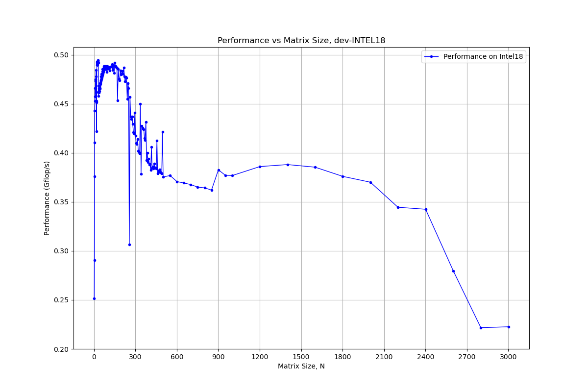
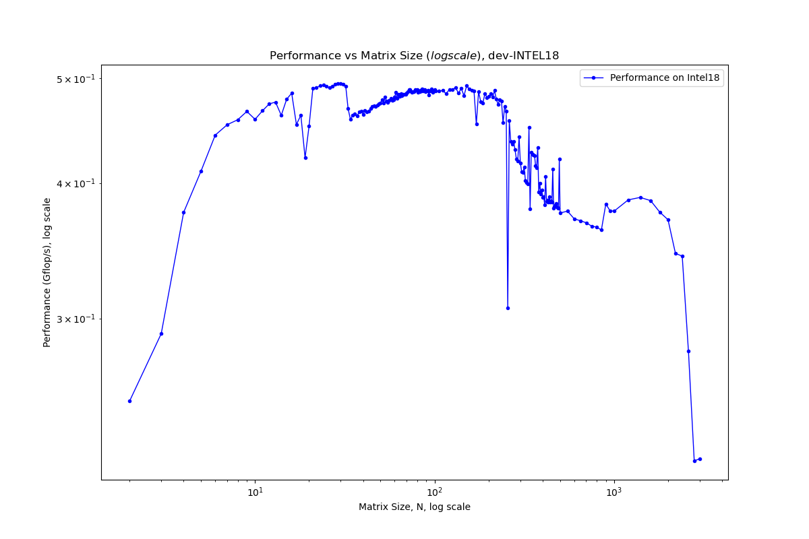
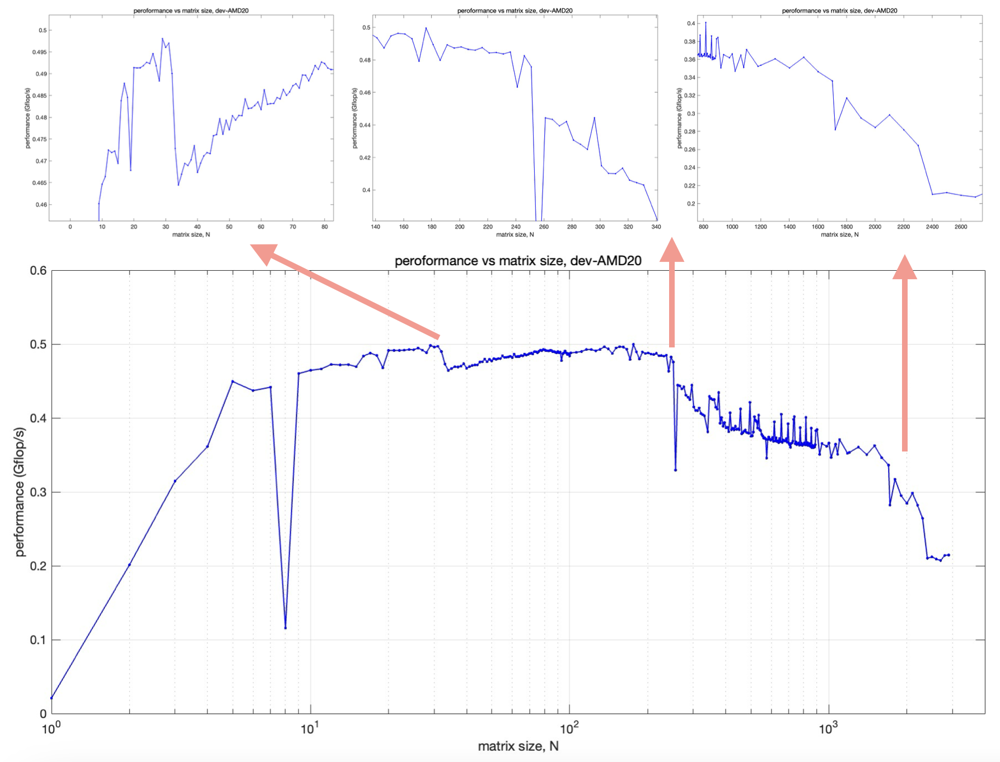
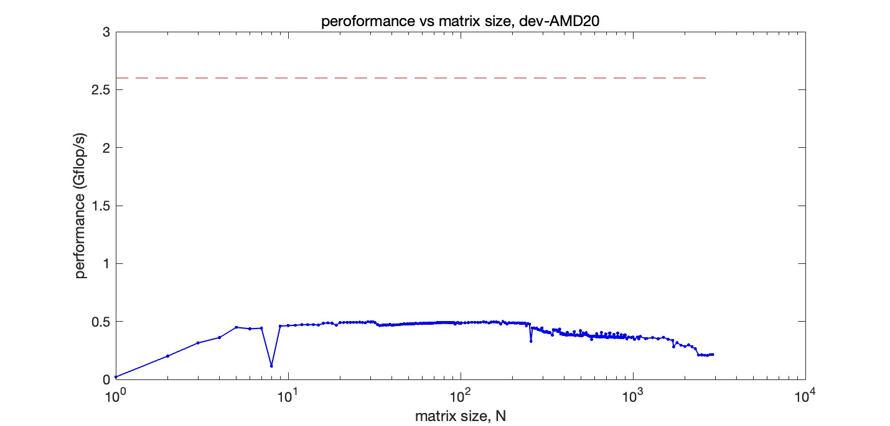

# 
 CMSE 822 &nbsp;&nbsp;&nbsp; SS24
## 
  Project 1  Memory Hierarchies and Performance of Serial Applications

  &#9786; Team 1  

  Benjamin DalFavero, Reza Khan Mohammadi, Tairan Song, Xiaotian Hua, Ziyu Cheng
  

## Warm-up

| | Operations (FLOPs) | Memory access (byte) | Algorithmic intensity (FLOPs/byte) |
| --- | --- | --- | --- |
|   Y[j] += Y[j] + A[j][i] * B[i] | 3 | 32 | 0.094 | 
|     s += A[i] * A[i]            | 2 | 8  | 0.250 | 
|     s += A[i] * B[i]            | 2 | 16 | 0.125 | 
|     Y[i] = A[i] + C*B[i]        | 2 | 24 | 0.167 |   

## Part 1 :  Matrix-matrix Multiplication

### Q2. For a given matrix size N, what is the total number of floating point operations performed by this operator?  

In a N*N matrix, the total number of floating point operations performed by matrix multiplication is $N^3+N^2(N-1)=N^2(2N-1)$ .   

### Q3. Compute the performance in Mflop/s of the matrix-matrix multiply for N=100.
Considering a matrix of size `100`, we repeated calculation for `20` times, the performance achieved is:
- *Performance:* 575.928 Mflops/s
- *Average time:* 0.003455 s
- *Floating-point operations:*  $100^2*(2*100-1) / 10^3 = 1.99$ Mflops

### Q4. How does the performance you measured in (3) compare to the theoretical peak performance of your system?
The laptop is Apple M2 pro chips:
- *CPU:* 12 cores
- *Clock speed:* 3.4 GHz
- *Cache:* 192 KB instruction cache, 128 KB data cache

Assuming one flop per clock cycle, the peak performance is: $12 \cdot 3.4 \cdot 1 = 40.8$ Gflop/s (3.4 Gflop/s per core).

The performance in (3) is _0.575 Gflop/s_ , which is significantly lower than the peak performance calculated above.

### Q5. Make a plot of the resulting measured Gflop/s vs. N.
#### Node 1: _Intel18_
- *CPU:* two 2.4 GHz 20-core Intel Xeon Gold 6148 CPUs (40 cores)
- Under the assumption of one flop per clock cycle, the theoretical peak performance is calculated as: $\rm 1\ flop \cdot 2.4\ GHz \cdot 1\ core = 2.4\ Gflop/s$.    
- L1d cache: 32    KB  
- L1i cache: 32    KB  
- L2  cache: 1024  KB
- L3  cache: 28160 KB

#### Node 2: _Amd20_
- *CPU:* one 2.6 GHz AMD EPYC 7H12 64-Core CPU
- Under the assumption of one flop per clock cycle, the theoretical peak performance is: $\rm 1\ flop \cdot 2.6\ GHz \cdot 1\ core = 2.6\ Gflop/s$.  
- L1d cache: 32    KB  
- L1i cache: 32    KB  
- L2  cache: 512   KB
- L3  cache: 16384 KB  

**NOTE**: For matrix size N, when we do matrix multiplication A=B*C, the memory space needed will be      
N = 1000, 1000^2 floating number * 8 byte * 3 matrices / 1024^2 $\approx$
 24  MB;  
N = 3000, 3000^2 floating number * 8 byte * 3 matrices / 1024^2 $\approx$ 216 MB;   
N = 4000, 4000^2 floating number * 8 byte * 3 matrices / 1024^2 $\approx$ 384 MB.  

We run matrix size from 1 to 3000, and the performance graphs, illustrating performance (Gflops/s) vs matrix size (N), are shown below:   

   

If we add the theoretical peak level for a single core, it would be:  

### Q6. How does the measured performance for multiple N’s compare to peak? Are there any “features” in the plot? Explain them in the context of the hardware architecture of your system. Include in your write-up a description of your system’s architecture (processor, cache, etc.)   

On both architectures (Intel18 & Amd20), the performance(Gflop/s) graph line rises rapidly as the matrix size gets bigger at the beginning (matrix size within 100 or so), after matrix size reaches 100, the trend of performance graph line becomes flatten, and then it goes down in a stepwise manner as the matrix size keeps enlarged.  

The positions where those stepwise decreases taking place may correspond to the memory space needed reaches L1, L2, L3 cache capacity respectively.

Based on the cache data presented in Q5, we calculate the matrix size corresponding to each cache level. We do calculation by using the  formula,  $\rm Cache \ size(KB) = N^2 \cdot 3 \cdot 8 / 1024$ .  

|*Intel18*| cache      |matrix size, N       |
|---|---         |---          |
| |L1 (64KB)          |52            |
| |L2 (1024KB)        |215          |
| |L3 (28160KB)       |1118         |

|*Amd20*| cache      |matrix size, N      |
|---|---         |---          |
| |L1 (64KB)          |52           |
| |L2 (512KB)         |157          |
| |L3 (16384KB)         |851          |
| |*L3 (256MB, data from official website)|3308          |

However, on Amd20, there are some discrepancies with the calculated results. While the boundaries of L1 and L2 can be explained by hardware or algorithm strategies, the drop boundary of L3 seems to be much larger than the predicted N value. I don't know the reason for this at the moment, but I noticed that the L3 cache data on the official AMD EPYC 7H12 CPU website (https://www.amd.com/en/products/cpu/amd-epyc-7h12) is slightly larger than the data output by `lscpu`. The official data is 256MB, which might align more closely with the calculated data.  

---
## Part 2: The Roofline Model 

### Q3 
  

  

   Approximately...
   - For AMD:
     - Ridge point is 13.6 GFLOPs/s at an operational intensity of about 0.19 FLOPs/byte for L1.
     - Ridge point is 13.6 GFLOPs/s at an operational intensity of about 1.2 FLOPs/byte for DRAM.
   - For Intel:
     - Ridge point is 10.1 GFLOPs/s at an operational intensity of about 0.22 FLOPs/byte for L1.
     - Ridge point is 10.1 GFLOPs/s at an operational intensity of about 0.31 FLOPs/byte for L2.
     - Ridge point is 10.1 GFLOPs/s at an operational intensity of about 0.5 FLOPs/byte for DRAM.

### Q4  
Below are the results predicted for the kernels in the Roofline paper.

- **AMD20**
   
| Kernel    | Operational intensity (FLOPs/byte) | L1 | L1 performance (GFLOP/s) | DRAM | DRAM performance (GFLOP/s) |
| --------- | --------------------------------- | --- | ------------------------ | ---- | -------------------------- |
| SpMV      | 0.25                            | Comp | 13.60 |  Mem | 3.00 |
| LBMHD     | 1.07                            | Comp | 13.60 | Mem | 12.90 |
| Stencil   | 0.50                            | Comp | 13.60 | Mem | 6.00 | 
| 3-D FF    | 1.64                            | Comp | 13.60 | Comp | 13.60 |

- **Intel18**

| Kernel    | Operational intensity (FLOPs/byte) | L1 | L1 performance (GFLOP/s) | L2 | L2 performance (GFLOP/s) | DRAM | DRAM performance (GFLOP/s) |
| --------- | --------------------------------- | --- | --- | --- | --- | --- | --- |
| SpMV      | 0.25                            | Comp | 10.10    | Mem | 8.00    | Mem | 5.00    |
| LBMHD     | 1.07                            | Comp | 10.10    |  Comp | 10.10    |  Comp | 10.10    | 
| Stencil   | 0.50                            | Comp | 10.10    |  Comp | 10.10    |  Comp | 10.10    | 
| 3-D FF    | 1.64                            | Comp | 10.10    |  Comp | 10.10    |  Comp | 10.10    | 

For the `SpMV` kernel, performance is compute bound for the L1 cache, and memory bound for the DRAM cache. Storage of the amtrix should
be optimized so that all of the matrix elements that are needed for the next steps of the computation are stored in L1 cache. Additionally,
SIMD instructions can be used to great advantage due to the structure of matrix-vector multiplication. For `LBMHD`, the paper remarks that 
the no-allocate store optimization yields maximal operations intensity. This is the same operational intensity as is need to reach the ridge point
for both L1 cache and DRAM on the AMD 20. For the `Stencil` kernel, a large improvement might be made by using SIMD instructions (such as on a GPU)
due to the regularity of stencils. This would negate the need to do an many iterations. The Fast Fourier transform is compute bound even for DRAM
access, so optimization is not necessary. 

### Q5 

Below are the performances predicted for the kernels in the warmup exercise.

 - **AMD**

|     | Operational intensity (FLOPs/byte) | L1 | L1 performance (GFLOP/s) | DRAM | DRAM performance (GFLOP/s) |
| --------- | --------------------------------- | --- | ------------------------ | ---- | -------------------------- |
| Y[j] += Y[j] + A[j][i] * B[i]      | 0.094                            | Mem | 7.00 |  Mem | 1.10 |
| s += A[i] * A[i]                   | 0.250                            | Comp | 13.6 | Mem | 3.00 |
| s += A[i] * B[i]                   | 0.125                            | Mem | 8.00 | Mem | 1.50 | 
| Y[i] = A[i] + C*B[i]               | 0.167                            | Mem | 10.00 | Mem | 1.80 |

For the AMD architecture, kernels like `Y[j] += Y[j] + A[j][i] * B[i]`, with lower operational intensity, are primarily memory-bound, indicating a performance bottleneck due to memory access. Conversely, kernels with higher operational intensity, like `s += A[i] * A[i]`, are compute-bound at the L1 level, showing their efficient utilization of the processor's computational capacity. These results suggest that memory access optimization is crucial for kernels with low operational intensity, while maximizing computational efficiency is key for those with high intensity.

- **Intel**

|     | Operational intensity (FLOPs/byte) | L1 | L1 performance (GFLOP/s) | L2 | L2 performance (GFLOP/s) | DRAM | DRAM performance (GFLOP/s) |
| --------- | --------------------------------- | --- | --- | --- | --- | --- | --- |
| Y[j] += Y[j] + A[j][i] * B[i]      | 0.094                            | Mem |  4.00  | Mem |  3.00  | Mem |  1.80  |
| s += A[i] * A[i]                   | 0.250                            | Comp |  10.10  |  Mem |  8.00  |  Mem |  5.00   | 
| s += A[i] * B[i]                   | 0.125                            | Mem |  5.00  |  Mem |  4.00  |  Mem |  2.50   | 
| Y[i] = A[i] + C*B[i]               | 0.167                            | Mem |  7.00  |  Mem |  5.00  |  Mem |  3.00   | 

In the case of Intel architecture, the table reflects a similar trend of kernels being compute-bound or memory-bound based on their operational intensity. For example, the `SpMV` kernel, despite being compute-bound at the L1 level, becomes memory-bound at L2 and DRAM levels, indicating a potential memory bottleneck. This implies that for Intel, performance optimization strategies need to focus not only on computational efficiency but also on effective memory utilization, especially for L2 and DRAM. The kernels with higher operational intensity, like `3-D FF`, maintain compute-bound status across all cache levels, demonstrating their capability to exploit the processor's compute power efficiently.

### Q6
Our matrix multiplication results give a maximum performance of about 0.5 GFLOPs. Given that this kernel has an operational intensity
of 0.75, our predicted maximum performance is 10.1 GFLOPs/s on Intel 18 and 7.5 to 13.6 GFLOPs, depending on wether we are reading from DRAM
or the L1 cache. Our performance shows characteristic "drops" where rows of a matrix can no longer fit into a certain cache level. For more details,
see part 1 of our writeup above. 
