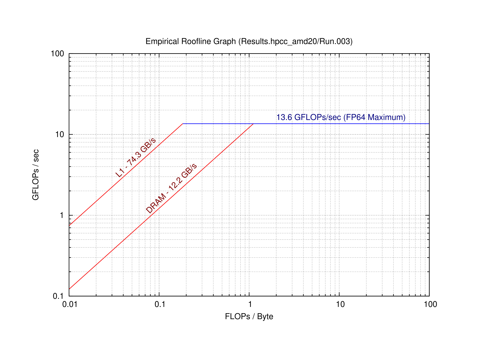
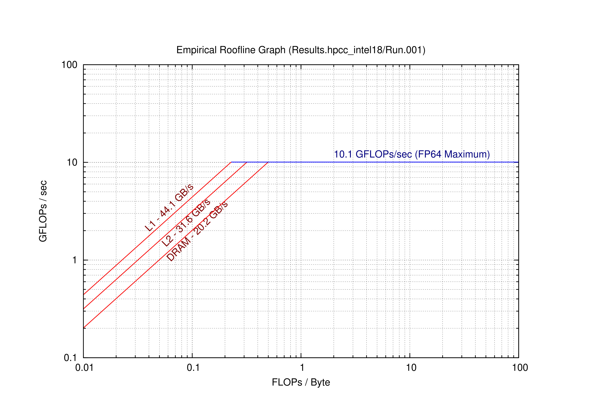

# Part 2:  The Roofline Model

### Q3 
  

  

   Approximately...
   - For AMD:
     - Ridge point is 13.6 GFLOPs/s at an operational intensity of about 0.19 FLOPs/byte for L1.
     - Ridge point is 13.6 GFLOPs/s at an operational intensity of about 1.2 FLOPs/byte for DRAM.
   - For Intel:
     - Ridge point is 10.1 GFLOPs/s at an operational intensity of about 0.22 FLOPs/byte for L1.
     - Ridge point is 10.1 GFLOPs/s at an operational intensity of about 0.31 FLOPs/byte for L2.
     - Ridge point is 10.1 GFLOPs/s at an operational intensity of about 0.5 FLOPs/byte for DRAM.

### Q4  
Below are the results predicted for the kernels in the Roofline paper.

- **AMD20**
   
| Kernel    | Operational intensity (FLOPs/byte) | L1 | L1 performance (GFLOP/s) | DRAM | DRAM performance (GFLOP/s) |
| --------- | --------------------------------- | --- | ------------------------ | ---- | -------------------------- |
| SpMV      | 0.25                            | Comp | 13.60 |  Mem | 3.00 |
| LBMHD     | 1.07                            | Comp | 13.60 | Mem | 12.90 |
| Stencil   | 0.50                            | Comp | 13.60 | Mem | 6.00 | 
| 3-D FF    | 1.64                            | Comp | 13.60 | Comp | 13.60 |

For the `SpMV` kernel, performance is compute bound for the L1 cache, and memory bound for the DRAM cache. Storage of the amtrix should
be optimized so that all of the matrix elements that are needed for the next steps of the computation are stored in L1 cache. Additionally,
SIMD instructions can be used to great advantage due to the structure of matrix-vector multiplication. For `LBMHD`, the paper remarks that 
the no-allocate store optimization yields maximal operations intensity. This is the same operational intensity as is need to reach the ridge point
for both L1 cache and DRAM on the AMD 20.   

- **Intel18**

| Kernel    | Operational intensity (FLOPs/byte) | L1 | L1 performance (GFLOP/s) | L2 | L2 performance (GFLOP/s) | DRAM | DRAM performance (GFLOP/s) |
| --------- | --------------------------------- | --- | --- | --- | --- | --- | --- |
| SpMV      | 0.25                            | Comp | 10.10    | Mem | 8.00    | Mem | 5.00    |
| LBMHD     | 1.07                            | Comp | 10.10    |  Comp | 10.10    |  Comp | 10.10    | 
| Stencil   | 0.50                            | Comp | 10.10    |  Comp | 10.10    |  Comp | 10.10    | 
| 3-D FF    | 1.64                            | Comp | 10.10    |  Comp | 10.10    |  Comp | 10.10    | 

For the `SpMV` kernel, performance is compute bound for the L1 cache, and memory bound for the L2 cache and DRAM. Storage of the amtrix should
be optimized so that all of the matrix elements that are needed for the next steps of the computation are stored in L1 cache. Storing elements in L2 cache
is perferable to DRAM in this case. 

### Q5 
Below are the performances predicted for the kernels in the warmup exercise.

 - **AMD**

|     | Operational intensity (FLOPs/byte) | L1 | L1 performance (GFLOP/s) | DRAM | DRAM performance (GFLOP/s) |
| --------- | --------------------------------- | --- | ------------------------ | ---- | -------------------------- |
| Y[j] += Y[j] + A[j][i] * B[i]      | 0.094                            | Mem | 7.00 |  Mem | 1.10 |
| s += A[i] * A[i]                   | 0.250                            | Comp | 13.6 | Mem | 3.00 |
| s += A[i] * B[i]                   | 0.125                            | Mem | 8.00 | Mem | 1.50 | 
| Y[i] = A[i] + C*B[i]               | 0.167                            | Mem | 10.00 | Mem | 1.80 |

For the AMD architecture, kernels like `Y[j] += Y[j] + A[j][i] * B[i]`, with lower operational intensity, are primarily memory-bound, indicating a performance bottleneck due to memory access. Conversely, kernels with higher operational intensity, like `s += A[i] * A[i]`, are compute-bound at the L1 level, showing their efficient utilization of the processor's computational capacity. These results suggest that memory access optimization is crucial for kernels with low operational intensity, while maximizing computational efficiency is key for those with high intensity.

- **Intel**

|     | Operational intensity (FLOPs/byte) | L1 | L1 performance (GFLOP/s) | L2 | L2 performance (GFLOP/s) | DRAM | DRAM performance (GFLOP/s) |
| --------- | --------------------------------- | --- | --- | --- | --- | --- | --- |
| Y[j] += Y[j] + A[j][i] * B[i]      | 0.094                            | Mem |  4.00  | Mem |  3.00  | Mem |  1.80  |
| s += A[i] * A[i]                   | 0.250                            | Comp |  10.10  |  Mem |  8.00  |  Mem |  5.00   | 
| s += A[i] * B[i]                   | 0.125                            | Mem |  5.00  |  Mem |  4.00  |  Mem |  2.50   | 
| Y[i] = A[i] + C*B[i]               | 0.167                            | Mem |  7.00  |  Mem |  5.00  |  Mem |  3.00   | 

In the case of Intel architecture, the table reflects a similar trend of kernels being compute-bound or memory-bound based on their operational intensity. For example, the `SpMV` kernel, despite being compute-bound at the L1 level, becomes memory-bound at L2 and DRAM levels, indicating a potential memory bottleneck. This implies that for Intel, performance optimization strategies need to focus not only on computational efficiency but also on effective memory utilization, especially for L2 and DRAM. The kernels with higher operational intensity, like `3-D FF`, maintain compute-bound status across all cache levels, demonstrating their capability to exploit the processor's compute power efficiently.

### Q6
Our matrix multiplication results give a maximum performance of about 0.5 GFLOPs. Given that this kernel has an operational intensity
of 0.75, our predicted maximum performance is 10.1 GFLOPs/s on Intel 18 and 7.5 to 13.6 GFLOPs, depending on wether we are reading from DRAM
or the L1 cache. 
